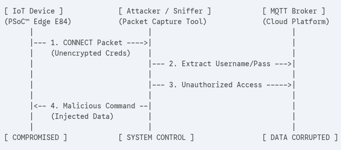
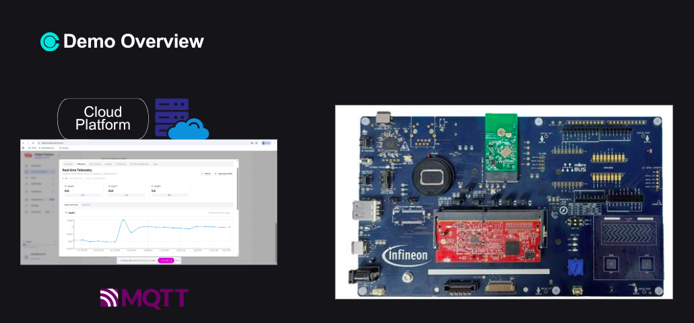
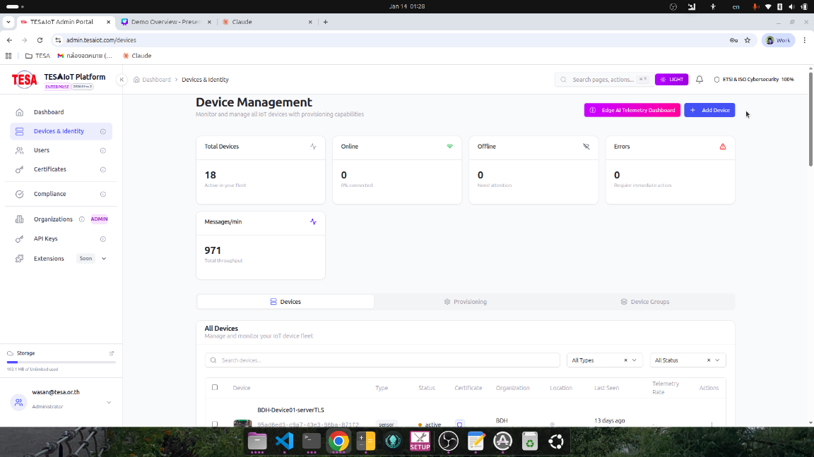
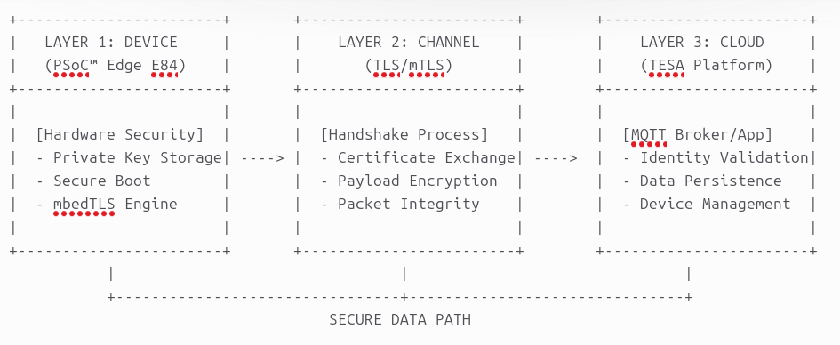
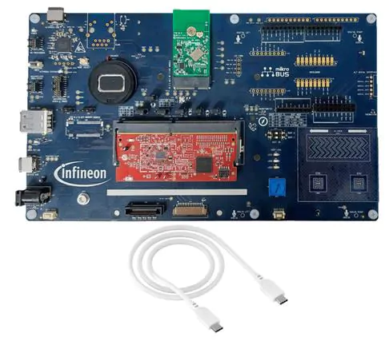
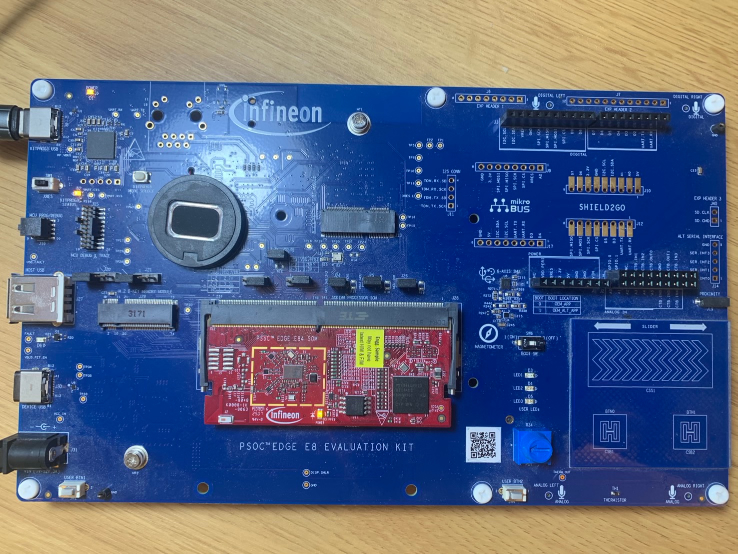
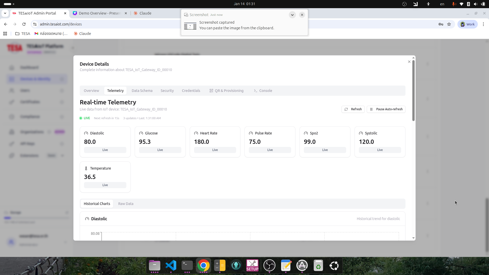

# Building Secure MQTT IoT Applications on PSoC™ Edge E84

**A Complete Tutorial for TESA IoT Platform Integration**

---

## Why MQTT Security Matters

**Imagine:** You've deployed hundreds of IoT sensors reporting to your cloud platform. One day, an attacker intercepts your WiFi traffic, extracts device credentials, and starts injecting false sensor data into your dashboard.

**This is preventable.** Proper MQTT security protects your entire IoT ecosystem.

<div align="center">



*How unsecured MQTT connections expose your entire IoT infrastructure*

</div>

### The Problem vs The Solution

| | ❌ Unsecured MQTT | ✅ With TLS/mTLS |
|---|---|---|
| **Credentials** | Plaintext (sniffable) | Encrypted transport |
| **Device identity** | Username/password only | Certificate-based authentication |
| **Data in transit** | Visible to attackers | End-to-end encrypted |
| **Impersonation** | Easy to fake devices | Cryptographic proof required |

<div align="center">




*TESA IoT Platform - Secure cloud infrastructure with TLS/mTLS support*

</div>

**[Read full security analysis →](docs/why-mqtt-security.md)**

---

## What You'll Learn in This Tutorial

This tutorial shows you how to build **production-ready secure IoT devices** that connect to the **TESA IoT Platform** using **MQTT over TLS/mTLS**:

### 📡 Part 1: Basic MQTT Connection (30 min)
**Connect your first device** - Create MQTT WiFi project, configure credentials, establish connection

### 🔐 Part 2: Server TLS Authentication (45 min)
**Verify server identity** - Add server CA certificate, enable TLS, prevent man-in-the-middle attacks

### 🔒 Part 3: Mutual TLS Authentication (60 min)
**Prove device identity** - Generate device certificates on TESA platform, implement mTLS, achieve mutual authentication

**By the end:** You'll have production-ready secure MQTT devices reporting to your IoT dashboard.

---

## What Makes This Tutorial Different?

**✅ What's Included:**
- **Step-by-step project creation** - Using ModusToolbox™ Project Creator and Device Configurator
- **TESA platform integration** - Complete workflow from device registration to certificate generation
- **Real configuration files** - Copy-paste ready credentials and certificates
- **Security progression** - Unsecured → Server TLS → Mutual TLS
- **Debug techniques** - Serial logging and connection troubleshooting

**❌ What's NOT Covered (see official docs):**
- MQTT protocol internals → [MQTT.org](https://mqtt.org/)
- WiFi configuration details → [PSoC™ WiFi Library](https://github.com/Infineon/wifi-connection-manager)
- TLS/SSL deep dive → [ARM Mbed TLS Documentation](https://www.trustedfirmware.org/projects/mbed-tls/)

---

## System Architecture Overview

The PSoC™ Edge E84 connects securely to TESA IoT Platform:

<div align="center">



*Three-layer connectivity: Device (PSoC E84) → Secure Channel (TLS/mTLS) → Cloud (TESA Platform)*

</div>

**Key Security Properties:**
- ✅ **WiFi encryption** - WPA2/WPA3 wireless security
- ✅ **Transport security** - TLS 1.2+ encrypted MQTT
- ✅ **Mutual authentication** - Both client and server verify identity
- ✅ **Certificate-based trust** - Hardware-rooted device identity (optional OPTIGA integration)

---

## Tutorial Series

This series builds a **complete secure MQTT IoT system** in three progressive tutorials:

### 📘 Part 1: Basic MQTT WiFi Connection

**Repository:** [psoc-edge-mqtt-wifi-01-basic](https://github.com/nitikorn20/psoc-edge-mqtt-wifi-01-basic)

**What You'll Build:**
- Create MQTT WiFi project using ModusToolbox™ Project Creator
- Configure WiFi credentials and MQTT broker settings
- Establish basic connection and publish sensor data

**Why It Matters:** Foundation for any IoT device - get your device online.

**TESA Platform Setup:** Create account, register first device, obtain connection credentials.

**⏱️ Time:** 30 minutes | **📊 Difficulty:** Beginner

**Key Topics:**
- ModusToolbox™ Project Creator workflow
- WiFi Connection Manager configuration
- MQTT client library setup
- Device registration on TESA platform

---

### 📘 Part 2: Server TLS Authentication

**Repository:** [psoc-edge-mqtt-wifi-02-server-tls](https://github.com/nitikorn20/psoc-edge-mqtt-wifi-02-server-tls)

**What You'll Build:**
- Download TESA platform server CA certificate
- Import certificate into project using Device Configurator
- Enable TLS in MQTT client
- Verify encrypted connection with serial monitor

**Why It Matters:** Prevent man-in-the-middle attacks - ensure you're talking to the real server.

**TESA Platform Setup:** Download server CA certificate, update device security settings.

**⏱️ Time:** 45 minutes | **📊 Difficulty:** Intermediate

**Key Topics:**
- Certificate chain validation
- Device Configurator certificate import
- TLS handshake verification
- Connection troubleshooting

---

### 📘 Part 3: Mutual TLS (mTLS) Authentication

**Repository:** [psoc-edge-mqtt-wifi-03-mtls](https://github.com/nitikorn20/psoc-edge-mqtt-wifi-03-mtls)

**What You'll Build:**
- Generate device certificate/key pair on TESA platform
- Import client certificate and private key
- Configure mTLS in MQTT client
- Achieve mutual authentication (server verifies device, device verifies server)

**Why It Matters:** Maximum security - cryptographic proof that your device is genuine.

**TESA Platform Setup:** Generate device certificates, configure mTLS authentication, manage device lifecycle.

**⏱️ Time:** 60 minutes | **📊 Difficulty:** Advanced

**Key Topics:**
- Public key infrastructure (PKI)
- Certificate signing requests (CSR)
- Private key management
- Production certificate provisioning strategies

---

## Prerequisites

### Hardware

- **PSoC™ Edge E84 Evaluation Kit** ([KIT_PSE84_EVAL_EPC2](https://www.infineon.com/cms/en/product/evaluation-boards/kit-pse84-eval-epc2/))
  - Integrated WiFi 6 (802.11ax) module
  - Secure element support (optional OPTIGA™ Trust M integration)
- USB Type-C cable
- **WiFi Network** with internet access (WPA2/WPA3)

<div align="center">



*PSoC™ Edge E84 board with integrated WiFi 6 module*

</div>

**Required jumper configuration:**

<div align="center">



*Jumper configuration: BOOT SW=OFF, J20=NC, J21=NC*

</div>

### Software

- **ModusToolbox™ 3.6+** - [Download](https://www.infineon.com/modustoolbox)
  - Includes Project Creator, Device Configurator, and MQTT library
- **TESA IoT Platform Account** - [Register](https://iot.tesa.com) (replace with actual URL)
- **Serial Terminal** (Tera Term, PuTTY, or VS Code Serial Monitor)
  - Settings: 115200 baud, 8N1, no flow control

**Note:** All certificate management happens through web UI - no OpenSSL commands required.

### Knowledge

**Required:**
- ✅ Basic C programming
- ✅ Familiarity with ModusToolbox™ build/flash workflow
- ✅ Basic networking concepts (IP, DNS, TCP)

**NOT Required:**
- ❌ Deep WiFi protocol knowledge (Connection Manager handles this)
- ❌ TLS/SSL internals (Mbed TLS provides abstraction)
- ❌ Certificate generation with OpenSSL (TESA platform generates certificates)

---

## Quick Start (10 Minutes)

Get your first MQTT device online:
```bash
# 1. Clone the basic MQTT example
git clone https://github.com/wasanwiyrun/psoc_mqtt_wifi_connect_tesa_with_serverTls
cd psoc_mqtt_wifi_connect_tesa_with_serverTls

# 2. Update WiFi credentials in source/mqtt_client_config.h
#define WIFI_SSID       "YourNetworkName"
#define WIFI_PASSWORD   "YourPassword"
#define MQTT_BROKER_URL "mqtt.iot.tesa.com"  # Replace with actual URL
#define MQTT_USERNAME   "device_001"
#define MQTT_PASSWORD   "your_device_token"

# 3. Build the project
make -j8

# 4. Flash to device
make program

# 5. Open serial terminal (115200 baud, 8N1)
```

**Expected Output (Serial Monitor):**
```
===============================================================
PSOC Edge MCU: Wi-Fi MQTT Client
===============================================================


[431] chip ID: 55500, chip rev: 1, Support ChipId Read from SDIO Core 

[1819] WLAN MAC Address : 00:A0:50:09:C7:D0

[1821] WLAN Firmware    : wl0: May 30 2025 08:50:00 version 28.10.522.8 (c6a09ae) FWID 01-c782e3d9
, Chip ID : 55500
[1823] WLAN CLM         : API: 20.0 Data: IFX.BRANCH_18_53 Compiler: 1.49.5 ClmImport: 1.48.0 Customization: v3 24 

[1836] WHD VERSION      : 5.0.8.29128
[1836]  : 11ax v5.0.8
[1840]  : GCC 14.2
[1842]  : 2025-12-05 06:01:26 +0000

Wi-Fi Connection Manager initialized.

Wi-Fi Connecting to 'Bank_Was'

Successfully connected to Wi-Fi network 'Bank_Was'.
IPv4 Address Assigned: 172.20.10.3


MQTT library initialization successful.

'e312050e-3060-4c89-9108-bbd6ad301342' connecting to MQTT broker 'mqtt.tesaiot.com'...
MQTT connection successful.

MQTT client subscribed to the topic 'device/e312050e-3060-4c89-9108-bbd6ad301342/commands/#' successfully.

Press the USER BTN1 to publish "TURN ON"/"TURN OFF" on the topic 'device/e312050e-3060-4c89-9108-bbd6ad301342/tele.

Publisher: Publishing '{
  "heart_rate": 180,
  "spo2": 99,
  "temperature": 36.5,
  "glucose": 95.3,
  "systolic": 120,
  "diastolic": 80,
  "pulse_rate": 75,
  "timestamp": "2026-01-13T31:45:00Z"
}
' on the topic 'device/e312050e-3060-4c89-9108-bbd6ad301342/telemetry'
```

**🎉 Success!** Your device is now reporting to the TESA IoT Platform!

**👉 [See full tutorial in Part 1 repository →](https://github.com/nitikorn20/psoc-edge-mqtt-wifi-01-basic)**

---

## Real-World Use Cases

### Where Secure MQTT is Deployed

| Industry | Challenge | Solution |
|----------|-----------|----------|
| **🏭 Industrial IoT** | Factory machines report production metrics - downtime data must be accurate | Secure MQTT with mTLS prevents unauthorized devices from injecting false data |
| **🌡️ Environmental Monitoring** | Weather stations transmit real-time data - credentials exposed in field deployments | Certificate-based authentication prevents credential theft attacks |
| **🚰 Smart Infrastructure** | Water quality sensors across city - commands must come from authorized operators | Server TLS + command signing prevents malicious control commands |
| **🏠 Building Automation** | HVAC systems receive scheduling updates - energy theft is a concern | Encrypted MQTT prevents tampering with setpoint commands |

---

## TESA IoT Platform Integration

### Platform Features Used in This Tutorial

- ✅ **Device Management** - Register devices, manage lifecycle
- ✅ **Certificate Generation** - Automated PKI for device certificates
- ✅ **MQTT Broker** - Highly available broker with TLS/mTLS support
- ✅ **Telemetry Dashboard** - Real-time sensor data visualization
- ✅ **Command & Control** - Send commands to devices securely

<div align="center">



*TESA IoT Platform dashboard showing connected devices and telemetry*

</div>

**Platform Access:**
- Portal: https://iot.tesa.com (replace with actual)
- MQTT Broker: `mqtt.iot.tesa.com:8883` (TLS) / `mqtt.iot.tesa.com:8884` (mTLS)
- Documentation: [TESA IoT Docs](https://docs.iot.tesa.com)

---

## Additional Resources

### Official Documentation

- **[PSoC™ Edge E84 Documentation](https://www.infineon.com/cms/en/product/microcontroller/32-bit-psoc-arm-cortex-microcontroller/32-bit-psoc-edge-arm-cortex-m-based-family/psoc-edge-e84/)** - MCU reference manual
- **[ModusToolbox™ MQTT Library](https://github.com/Infineon/mqtt)** - API reference
- **[WiFi Connection Manager](https://github.com/Infineon/wifi-connection-manager)** - WiFi configuration guide
- **[Mbed TLS Documentation](https://www.trustedfirmware.org/projects/mbed-tls/)** - TLS implementation

### Standards & Protocols

- **[MQTT 3.1.1 Specification](https://mqtt.org/mqtt-specification/)** - Protocol reference
- **[TLS 1.2/1.3 RFCs](https://datatracker.ietf.org/doc/html/rfc5246)** - Transport Layer Security
- **[X.509 Certificates](https://datatracker.ietf.org/doc/html/rfc5280)** - Certificate format standard

### TESA Platform

- **[TESA IoT Platform Documentation](https://docs.iot.tesa.com)** - API and user guide
- **[TESA Developer Portal](https://portal.iot.tesa.com)** - Device registration
- **[TESA Support](https://support.tesa.com)** - Technical support

### Community

- **[Infineon Developer Community](https://community.infineon.com/)** - Forums and discussions
- **[ModusToolbox Forums](https://community.infineon.com/t5/ModusToolbox/bd-p/ModusToolbox)** - Build system help
- **[GitHub Issues](https://github.com/nitikorn20/psoc-edge-mqtt-wifi-tutorials/issues)** - Report problems

---

## Troubleshooting

### Common Issues

**WiFi Connection Fails:**
- ✅ Verify SSID and password are correct
- ✅ Check WiFi network has internet access
- ✅ Ensure WPA2/WPA3 (not WPA/WEP)

**MQTT Connection Timeout:**
- ✅ Verify broker URL and port
- ✅ Check firewall allows outbound TCP
- ✅ Confirm credentials are valid

**TLS Handshake Error:**
- ✅ Verify server CA certificate is correct
- ✅ Check system time is synchronized (TLS requires accurate time)
- ✅ Confirm TLS version compatibility (TLS 1.2+)

**Certificate Validation Failed:**
- ✅ Ensure certificate chain is complete
- ✅ Verify certificate hasn't expired
- ✅ Check certificate hostname matches broker URL

**[Full troubleshooting guide →](docs/troubleshooting.md)**

---

## Contributing

Found an issue or have suggestions?

- **Report Issues:** [GitHub Issues](https://github.com/nitikorn20/psoc-edge-mqtt-wifi-tutorials/issues)
- **Ask Questions:** [Infineon Community](https://community.infineon.com/)
- **TESA Platform Support:** [TESA Support Portal](https://support.tesa.com)

---

## License

- **Example Code:** MIT License
- **Documentation:** CC BY 4.0
- **PSoC™ is a trademark of Infineon Technologies AG**
- **TESA IoT Platform is a trademark of TESA Technology Co., Ltd.**

---

## Credits

- **Developed for:** TESA Training Program
- **Platform:** Infineon PSoC™ Edge E84 with WiFi 6
- **Cloud Platform:** TESA IoT Platform
- **Security Framework:** Arm Mbed TLS

---

<div align="center">

**🔒 Connect your IoT devices securely to the cloud**

[**Get Started →**](#quick-start-10-minutes) | [**Learn Why →**](docs/why-mqtt-security.md) | [**View Examples →**](#example-projects)

</div>